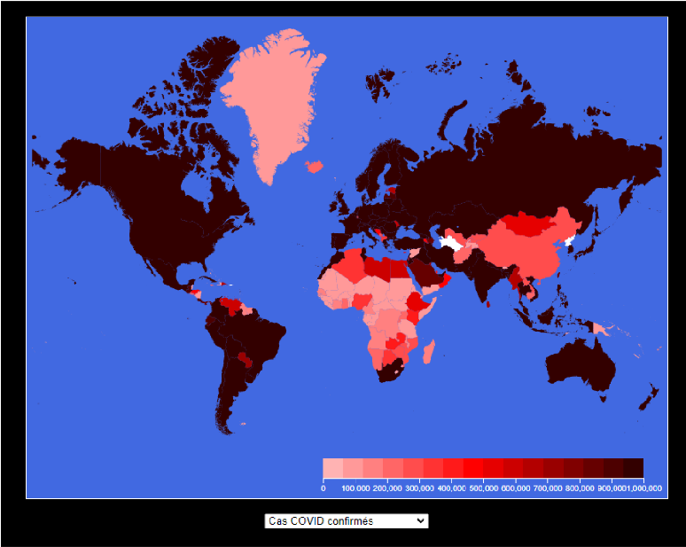
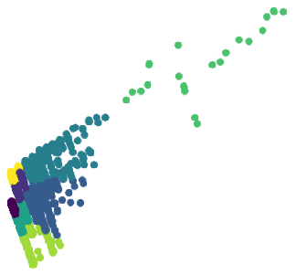
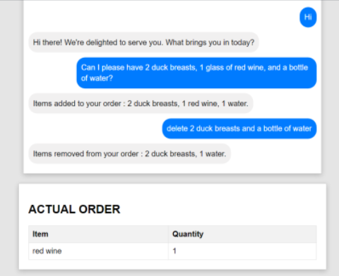
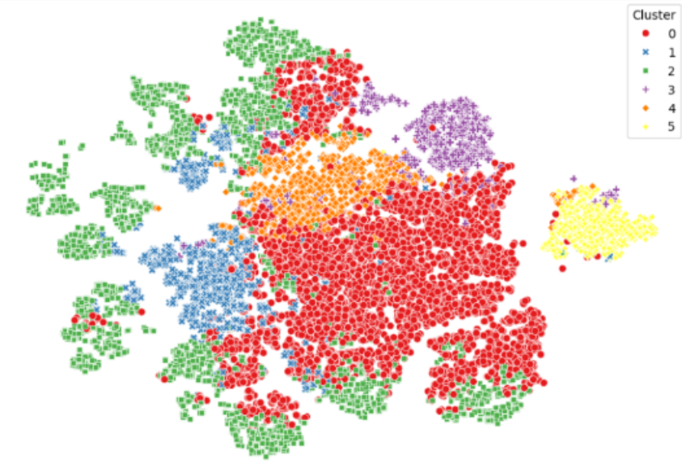

# 👋 Bienvenue sur mon GitHub !

Vous trouverez ici des projets réalisés durant mes études en **Licence informatique** et **Master Data Science**, ainsi que certains projets personnels, couvrant divers domaines tels que l'apprentissage automatique, l'analyse de données, la visualisation de données ou les jeux vidéos.

## 🚀 Projets phares

### 🔹 [Covid Situation](https://github.com/ks-tang/Portfolio/tree/master/Licence_informatique/DataViz_CovidSituation)
**Description rapide du projet** : Ce projet consiste à exploiter des données sur la situation épidémique du COVID-19 pour créer des visualisations graphiques claires et compréhensibles.
- 📌 **Points clés** : Visualisation dynamique et interactive des tendances de la pandémie avec D3JS

### 🔹 [Machine Learning pour la création de devis](https://github.com/ks-tang/Portfolio/tree/master/Master_DataScience/M1_Clustering)
**Description rapide du projet** : Ce projet porte sur l'identification de segments de clientèle cible afin d’optimiser les stratégies marketing d'une entreprise.
- 📌 **Points clés** : Extraction, traitement et analyse de données, sélection de caractéristiques pertinentes, Clustering K-Means

### 🔹 [Chatbot](Master_DataScience/M2_Chatbot)
**Description rapide du projet** : Création d'un chatbot de prise de commande pour un restaurant
- 📌 **Points clés** : Tensorflow, FastAPI, Flask, Docker, Tokenisation des données avec l'algorithme BERT, Entraînement des données, Reconnaissance d'entités nommées (NER), Déploiement de l'application
  

### 🔹 [Stage : Analyse comportementale pour la durabilité énergétique](Master_DataScience/M2_Stage_LIRIS)
**Description rapide du projet** : Ce projet vise à identifier les facteurs comportementaux les plus énergivores pour l'optimisation de la consommation d'énergie des ménages
- 📌 **Points clés** : Internet of Things (IoT), Internet of Behaviors (IoB), Etat de l'art, Traitement de données, Clustering, Feature Selection, Encodage, Analyse statistique, Corrélation

## 📫 Me contacter
- 💼 [LinkedIn](https://www.linkedin.com/in/ks-tang/)
- 📧 [Email](pro.tang.kevin@gmail.com)

Merci de visiter mon profil ! ⭐ N'hésitez pas à explorer mes projets !
