# 👋 Bienvenue sur mon GitHub !

Vous trouverez ici des projets réalisés durant mes études en **Licence informatique** et **Master Data Science**, ainsi que certains **projets personnels**, couvrant divers domaines tels que l'apprentissage automatique, l'analyse de données, la visualisation de données, le déploiements d'applications ou même les jeux vidéos.

---

## 🔎 Projets personnels 

### 🔹 [🤖 CHATBOT.IA — Assistant IA Vocal, RAG & Agent Autonome](https://github.com/ks-tang/ChatbotIA)
**Description rapide du projet** : Application web avec design inspiré de l'esthétique Nothing, combinant interaction vocale (STT/TTS), analyse de documents multi-formats (RAG) et automatisation d'actions via un agent autonome.
- 📌 **Points clés** : RAG côté client (PDF, TXT, CSV, images), intégration d'APIs (Groq, OpenRouter), synthèse/reconnaissance vocale, automatisation d'actions (e-mails via Resend/Gmail, calendrier), interface Next.js/Tailwind CSS responsive.
- **Lien vers le projet** : [Repository GitHub](https://github.com/ks-tang/ChatbotIA)
- **Lien vers l'application** : [CHATBOT.IA](https://chatbot-ia-kstang.vercel.app/)

  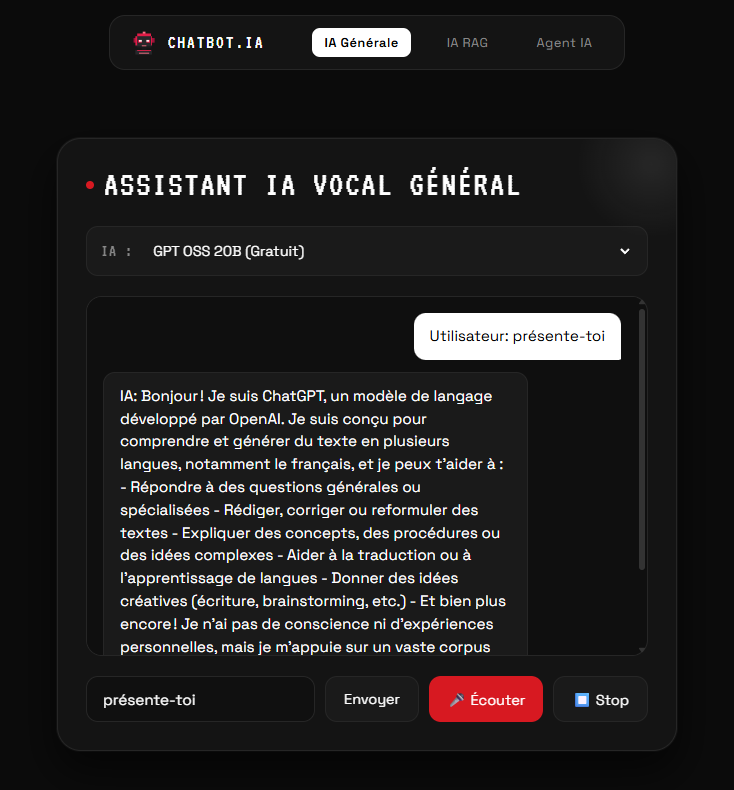
  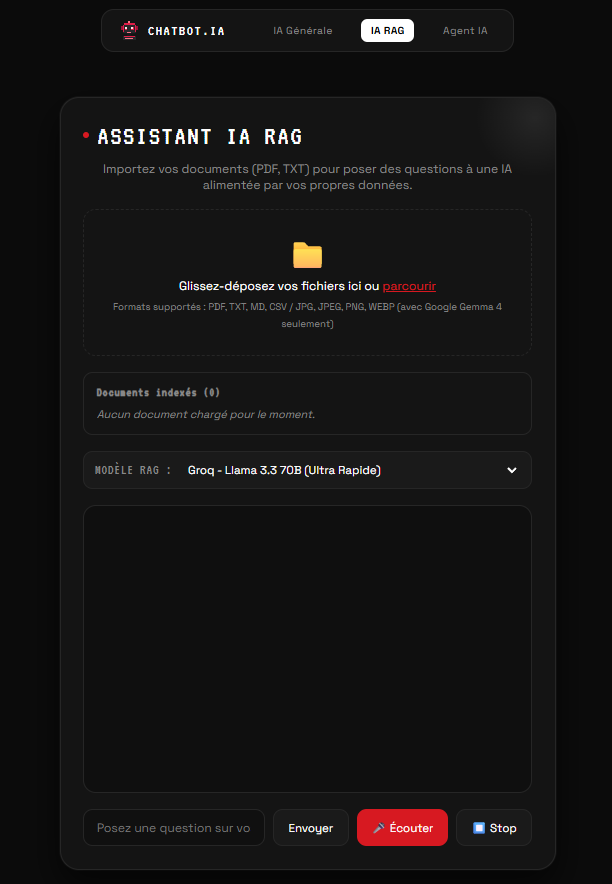
  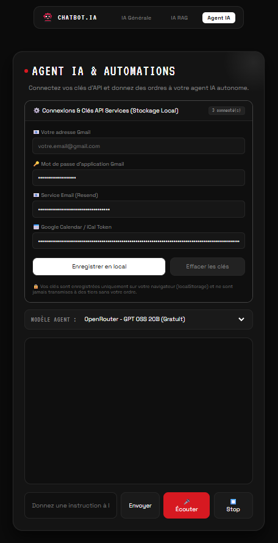

### 🔹 [👨‍👩‍👧‍👦 FamilyTree](https://github.com/ks-tang/family-tree) (Projet privé)
**Description rapide du projet** : Application web collaborative et sécurisée dédiée à l'histoire et à la vie de famille, structurée autour d'un arbre généalogique interactif et d'outils de partage communautaires.
- **Fonctionnalités** :
  - Arbre généalogique dynamique et collaborative en temps réel (ajout de membres, fiches détaillées avec dates, biographies et photos de profil).
  - Album photo partagé : Galerie chronologique avec système de marquage/identification des membres sur les clichés.
  - Calendrier commun : Suivi automatisé des anniversaires et centralisation des événements familiaux à venir.
  - Répertoire familial : Fiches individuelles regroupant les informations personnelles et l'ensemble des photos où la personne est identifiée.
  - Commutation instantanée en 1 clic de l'interface en trois langues (français, anglais, khmer).
  - La page d'accueil contient un carrousel des dernières photos ajoutées dans l'album et un rappel du prochain évènement à venir.
- 📌 **Points clés** :
  - Accès restreint & confidentialité : Espace strictement privé accessible uniquement sur invitation mail envoyée par l'administrateur. Protection intégrale des données personnelles et des médias.
  - Stack technique : Authentification et base de données hébergées sur Supabase ; déploiement et hébergement continu via Vercel.
  - Interface optimisée pour une expérience fluide sur smartphone, tablette et ordinateur.
 

  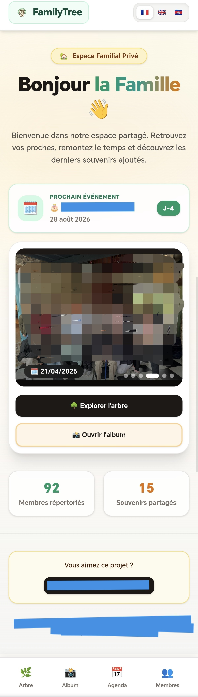
  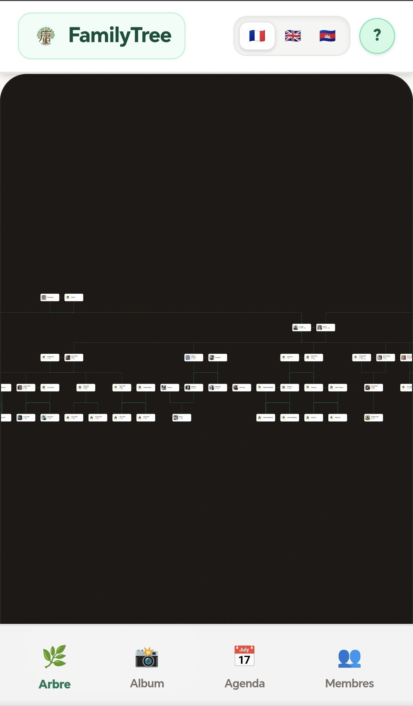
  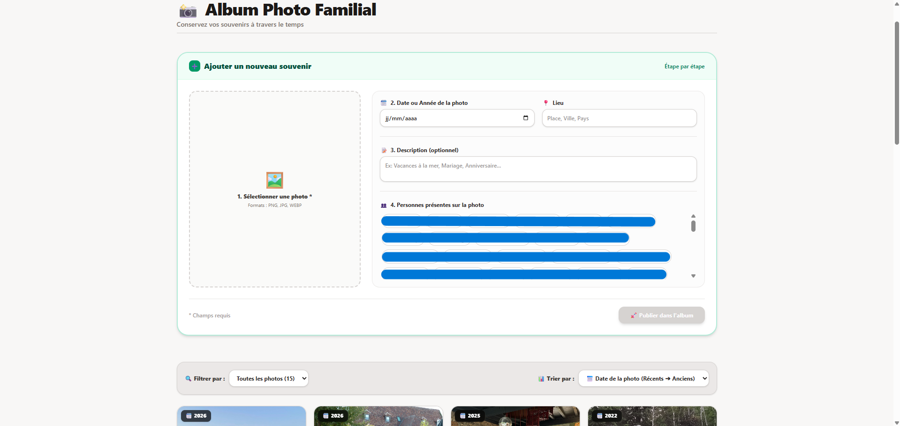
  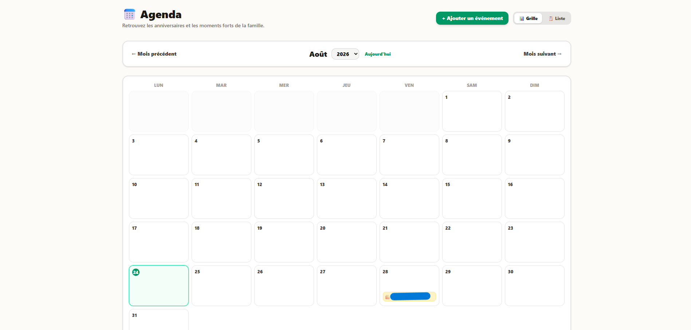

### 🔹 [🇨🇦 Québec & Montréal — Guide interactif & Cartographie](https://github.com/ks-tang/Quebec-Project)
**Description rapide du projet** : Application web interactive conçue pour explorer Québec et Montréal, analyser le marché immobilier local par quartier et planifier mes démarches d'installation/voyage (PVT, logistique, transports).
- 📌 **Points clés** : Cartographie interactive (Leaflet.js, GeoJSON), dashboard statistique des loyers (Chart.js), intégration des réseaux de transport (RTC/STM), checklist interactive avec sauvegarde locale (`localStorage`).
- **Lien vers le projet** : [Repository GitHub](https://github.com/ks-tang/Quebec-Project)
- **Lien vers l'application** : [Québec & Montréal Project](https://ks-tang.github.io/Quebec-Project/)

  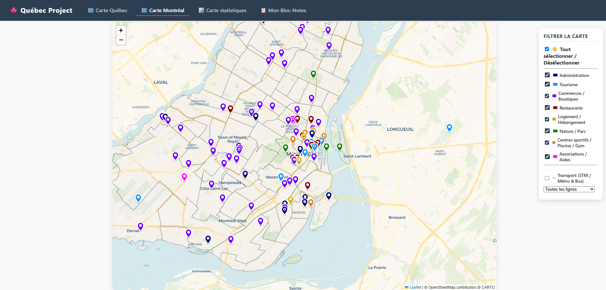

### 🔹 [🚗 Road Damage Detection avec YOLOv8](https://github.com/ks-tang/RoadDamageDetection)
**Description rapide du projet** : Détection et classification automatique des dégradations routières (fissures, nids-de-poule) à partir d'images grâce au modèle de vision par ordinateur YOLOv8.
- 📌 **Points clés** : Fine-tuning YOLOv8, préparation de dataset au format YOLO (images/labels), pipeline d'entraînement et d'inférence, détection d'objets en temps réel, évaluation des performances (mAP, matrices de confusion).
- **Lien vers le projet** : [Repository GitHub](https://github.com/ks-tang/RoadDamageDetection)

  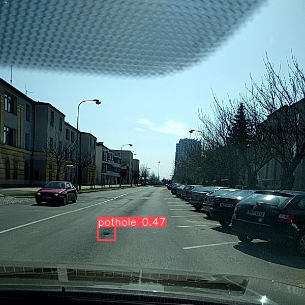
  
  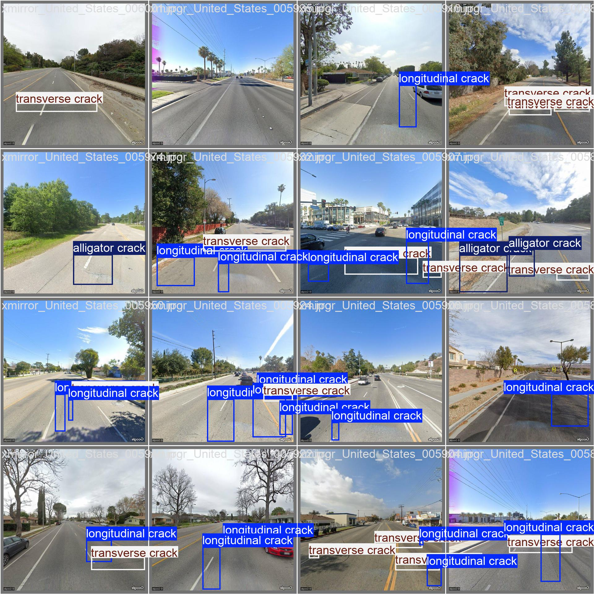

### 🔹 [📊 SalesReportingPipeline](https://github.com/ks-tang/SalesReportingPipeline)
**Description rapide du projet** : Ce projet met en place un pipeline de traitement des données de ventes d’un supermarché, depuis l’ingestion jusqu’à la visualisation.
- 📌 **Points clés** : ETL automatisé en Python, nettoyage des données, stockage dans PostgreSQL, visualisation interactive avec Power BI, conteneurisation Docker
- **Lien vers le projet** : [Lien](https://github.com/ks-tang/SalesReportingPipeline)

  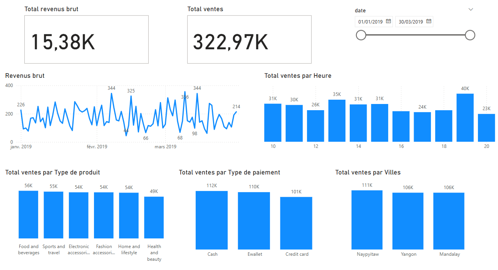
  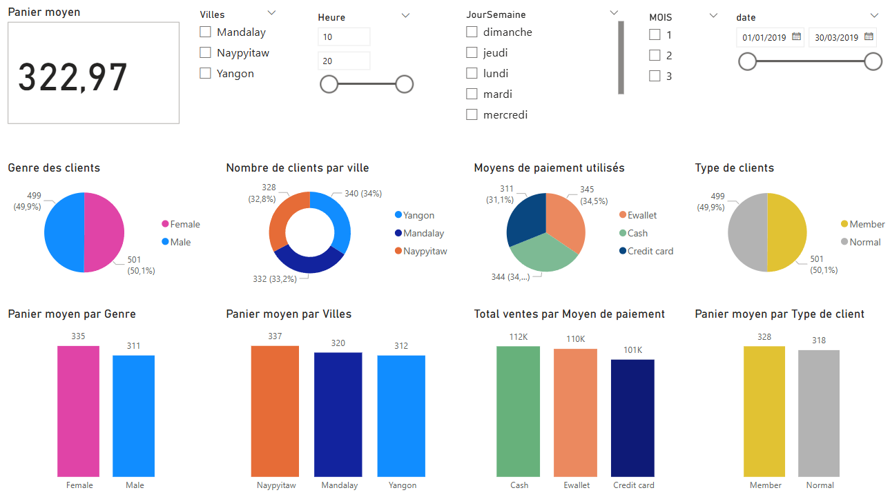
  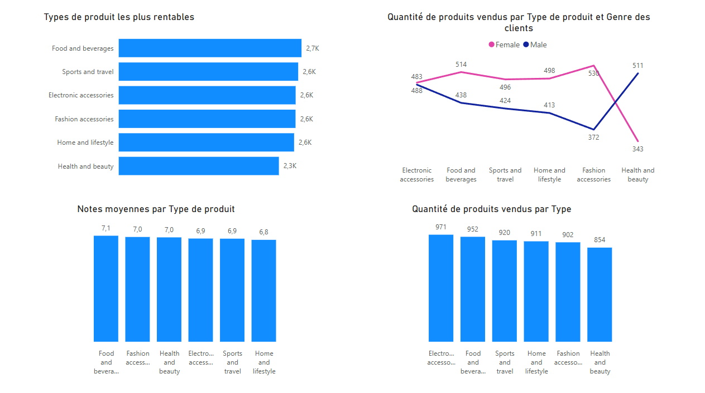

### 🔹 [🤖 Chatbot_CV](https://github.com/ks-tang/Chatbot_CV)
**Description rapide du projet** : Développement d’un chatbot intelligent capable de répondre aux questions d’un recruteur sur mon parcours, mes compétences et mes projets.
- 📌 **Points clés** : NLP avec TF-IDF & similarité cosinus, FastAPI, interface web HTML/CSS, déploiement cloud via Render, CI/CD avec GitHub Actions
- **Lien vers le projet** : [Lien](https://github.com/ks-tang/Chatbot_CV)
- **Lien vers le chatbot** : [Lien](https://chatbot-cv.onrender.com/) (attendre un peu si inactif)

  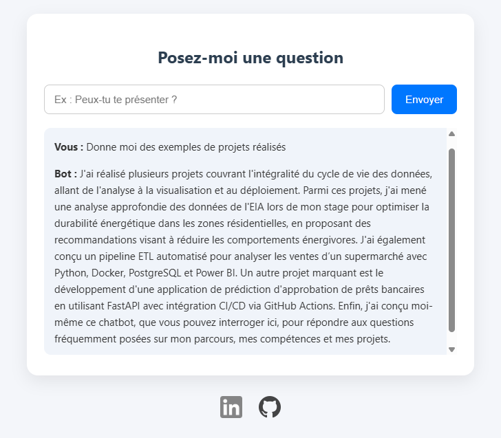

### 🔹 [🏦 Loan Approval Predictor](https://github.com/ks-tang/LoanPrediction)
**Description rapide du projet** : Application de Machine Learning web avec API FastAPI permettant de prédire en temps réel l'approbation d'une demande de prêt bancaire à partir du profil de l'emprunteur.
- 📌 **Points clés** : Prétraitement et comparaison de modèles ML (Random Forest, SVC, Logistic Regression), API backend FastAPI, conteneurisation Docker, tests unitaires, CI/CD avec GitHub Actions et déploiement cloud sur Render.
- **Lien vers le projet** : [Repository GitHub](https://github.com/ks-tang/LoanPrediction)
- **Lien vers l'application** : [Loan Approval Predictor](https://loanprediction-wpcl.onrender.com/) *(si actif)*

  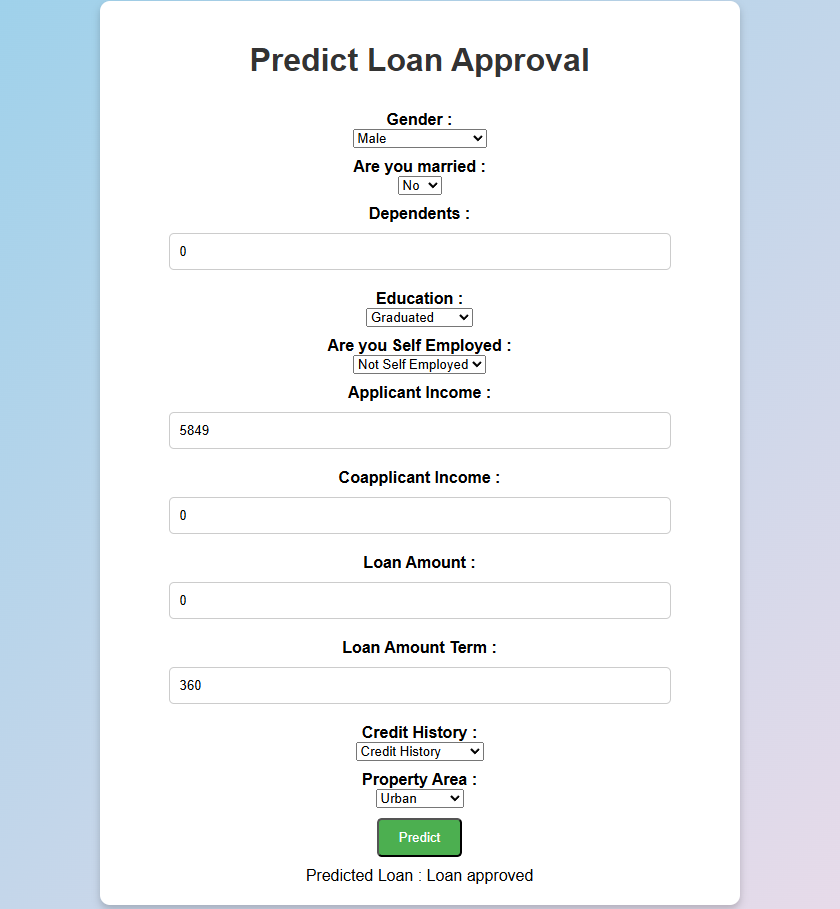

---

## 💻 Stage

### 🔹 [Stage : Analyse comportementale pour la durabilité énergétique](Master_DataScience/M2_Stage_LIRIS)
**Description rapide du projet** : Ce projet vise à identifier les facteurs comportementaux les plus énergivores pour l'optimisation de la consommation d'énergie des ménages.
- 📌 **Points clés** : Internet of Things (IoT), Internet of Behaviors (IoB), Etat de l'art, Traitement de données, Clustering, Feature Selection, Encodage, Analyse statistique, Corrélation, Rédaction d'article de recherche scientifique

  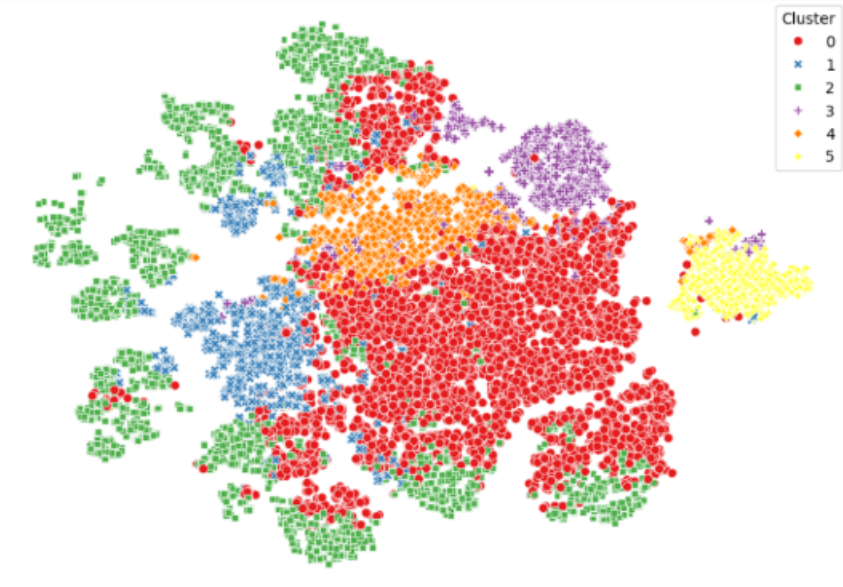

--- 

## 🎓 Projets académiques

### 🔹 [🦠 Covid Situation](https://github.com/ks-tang/Portfolio/tree/master/Licence_informatique/DataViz_CovidSituation)
**Description rapide du projet** : Ce projet consiste à exploiter des données sur la situation épidémique du COVID-19 pour créer des visualisations graphiques claires et compréhensibles.
- 📌 **Points clés** : Visualisation dynamique et interactive des tendances de la pandémie avec D3JS

  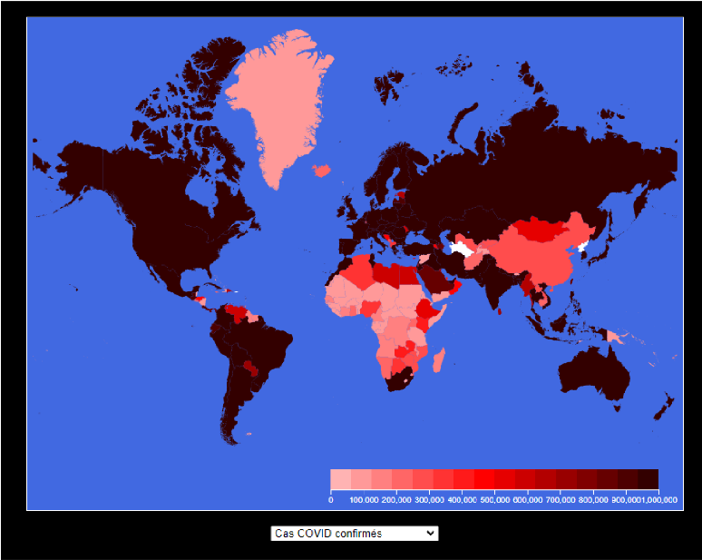

### 🔹 [🧾 Machine Learning pour la création de devis](https://github.com/ks-tang/Portfolio/tree/master/Master_DataScience/M1_Clustering)
**Description rapide du projet** : Ce projet porte sur l'identification de segments de clientèle cible afin d’optimiser les stratégies marketing d'une entreprise.
- 📌 **Points clés** : Extraction, traitement et analyse de données, sélection de caractéristiques pertinentes, Clustering K-Means

  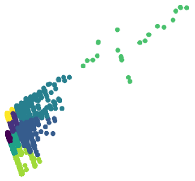

### 🔹 [🔍 Prédiction d'anomalies](Master_DataScience/M2_MachineLearning_Deploiement)
**Description rapide du projet** : Ce projet illustre le déploiement d'une application de machine learning en réalisant une prédiction d'image afin de détecter des anomalies dans un jeu de données.
- 📌 **Points clés** : Prédiction d'anomalies, Déploiement, Docker, FastAPI, Streamlit, Evidently, Machine Learning

  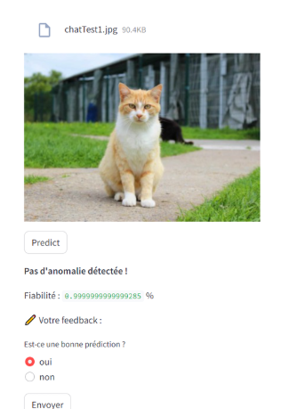

### 🔹 [🤖 Chatbot](Master_DataScience/M2_Chatbot)
**Description rapide du projet** : Création d'un chatbot de prise de commande pour un restaurant.
- 📌 **Points clés** : Tensorflow, FastAPI, Flask, Docker, Tokenisation des données avec l'algorithme BERT, Entraînement des données, Reconnaissance d'entités nommées (NER), Déploiement de l'application
  

  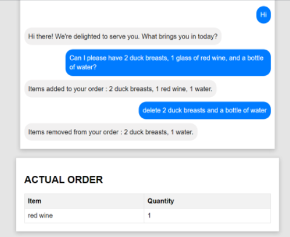

---

## 📜 Certifications

| Certification | Organisme | Aperçu | Fichier |
| :--- | :---: | :---: | :---: |
| **Google Data Analytics** | Google / Coursera | 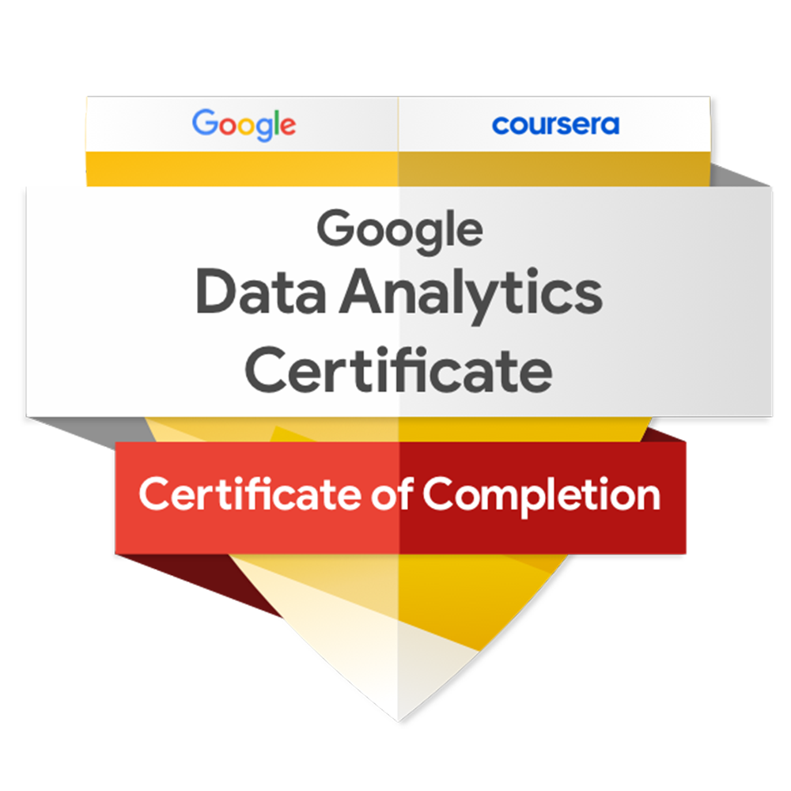 | [📄 PDF](./Certifications/GoogleDataAnalyticsProfessionalCertificatev2_Badge20250613-27-rewnwx.pdf) |
| **Microsoft Analyste de données** | Microsoft / LinkedIn | 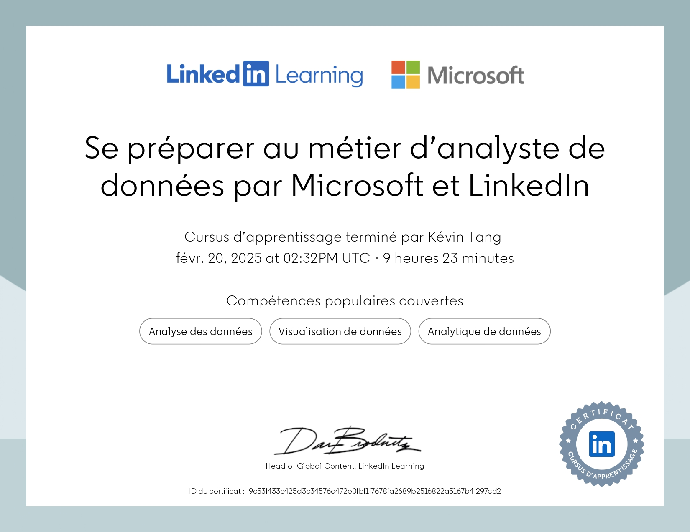 | [📄 PDF](./Certifications/MicrosoftLinkedIn_AnalysteDeDonnees.pdf) |
| **Google Certified Professional Machine Learning Engineer** | Google / Udemy |  | [📄 PDF](./Certifications/Udemy_GoogleCertifiedProfessionalMachineLearningEngineer.pdf) |
| **Power BI** | Udemy | 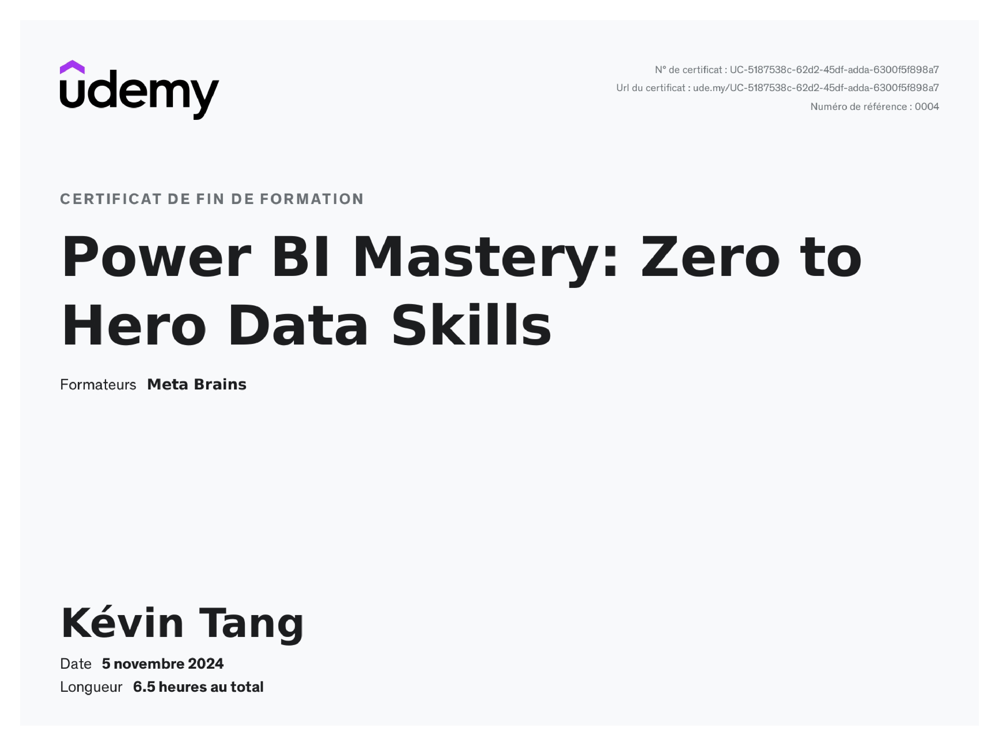 | [📄 PDF](./Certifications/Udemy_PowerBI.pdf) | 
| **Master In DataScience DataAnalytics DataAnalysis** | Udemy | 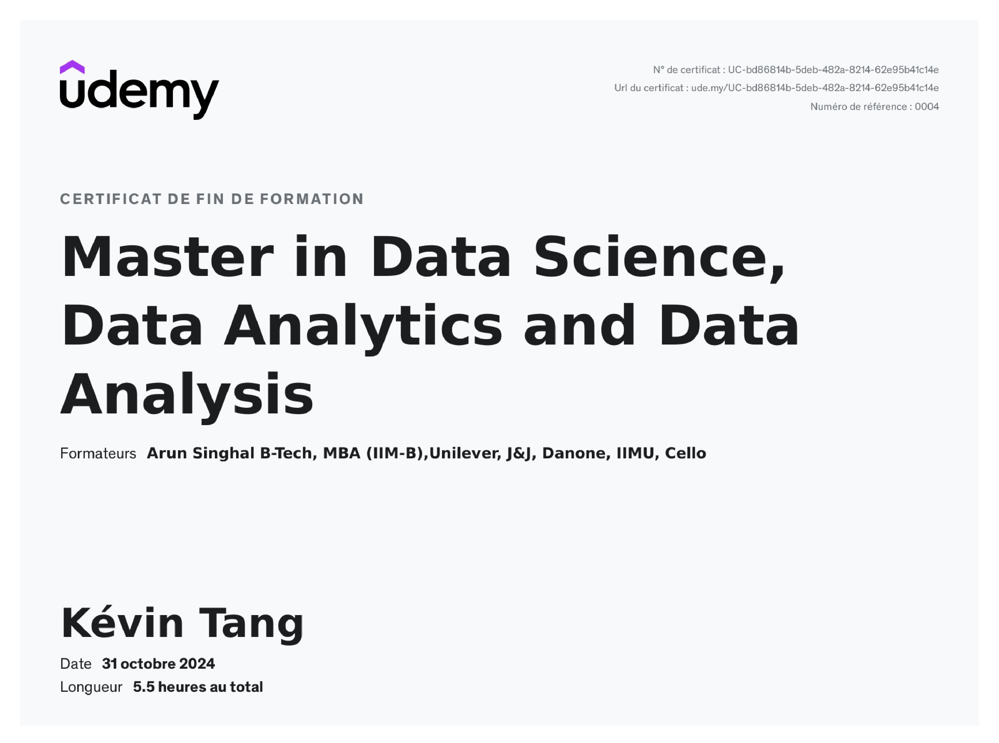 | [📄 PDF](./Certifications/Udemy_MasterIn_DataScience_DataAnalytics_DataAnalysis.pdf) |

---

## 🚀 Formations en ligne

- Power BI :
  - [Power BI Mastery: Zero to Hero Data Skills](https://www.udemy.com/course/power-bi-mastery-zero-to-hero-data-visualization-skills/)
 
- Amazon Web Services :
  - [Intro to Machine Learning in AWS for Beginners](https://www.udemy.com/course/intro-to-machine-learning-in-aws-for-beginners-new-2022/)
  - [Getting Started with Data Analytics on AWS](https://www.udemy.com/course/draft/3980204)

- Database Design & Development :
  - [Basics of Database Design & Development](https://www.udemy.com/course/database-design-development/)

- Data Scientist :
  - [Master in Data Science to become a Data Scientist](https://www.udemy.com/course/a-complete-roadmap-to-become-a-successful-data-scientist/)

- Data Analyst :
  - [Se préparer au métier d’analyste de données par Microsoft et LinkedIn](https://www.linkedin.com/learning/paths/se-preparer-au-metier-d-analyste-de-donnees-par-microsoft-et-linkedin-19745848)

- Business Analyst :
  - [Master Business Analysis to become a Business Analyst](https://www.udemy.com/course/master-in-business-analysis/)

- IA Générative : 
  - [Préparer votre carrière dans l'IA générative par Microsoft et LinkedIn](https://www.linkedin.com/learning/paths/preparer-votre-carriere-dans-l-ia-generative-par-microsoft-et-linkedin)
  - [Améliorez votre productivité grâce à l'IA générative avec Microsoft et LinkedIn](https://www.linkedin.com/learning/paths/ameliorez-votre-productivite-grace-a-l-ia-generative-avec-microsoft-et-linkedin)

---

## 📫 Me contacter
- 💼 [LinkedIn](https://www.linkedin.com/in/ks-tang/)
- 📧 [Email](mailto:pro.tang.kevin@gmail.com)

Merci de visiter mon profil ! ⭐ N'hésitez pas à explorer mes projets !
